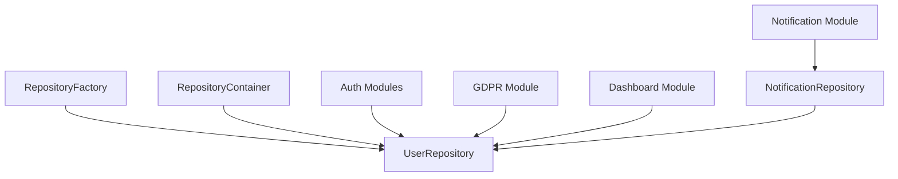
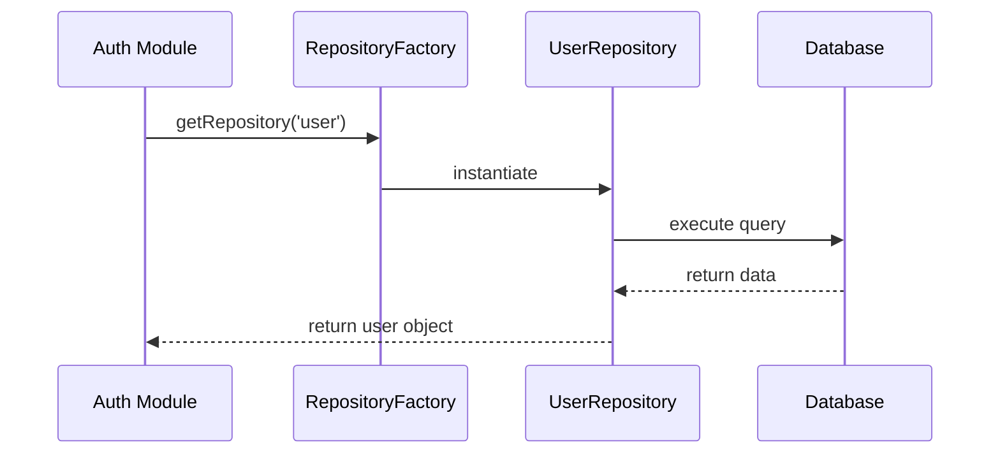

# User Repository Integration Plan

## Executive Summary

The current system exhibits inconsistent user data access patterns across authentication, notifications, GDPR compliance, and other user-centric modules. This plan outlines a comprehensive integration of the repository pattern for user functions to improve maintainability, scalability, and data consistency.

## Current State Analysis

### Repository Structure Issues

1. **Dual UserRepository Implementations**
   - **Legacy**: `backend/api/_database.js` (lines 1321-1425) with methods: `findWithFarmCount`, `createUser`, `findAuthData`, `updateLastLogin`
   - **Current**: `backend/api/repositories/user-repository.js` with methods: `findByEmail`, `findByIdWithProfile`, `createUser`, `updatePassword`, `emailExists`

2. **Missing Integration**
   - UserRepository not included in RepositoryFactory switch statement
   - UserRepository not instantiated in RepositoryContainer
   - No singleton access pattern for UserRepository

### Authentication Module Inconsistencies

| Module | User Data Access Method | Issues |
|--------|------------------------|--------|
| `login.js` | SimpleUserRepository (raw SQL) | Bypasses repository pattern |
| `signup.js` | SimpleUserRepository (raw SQL) | Inconsistent with other auth modules |
| `refresh.js` | UserRepository (proper) | Good pattern |
| `forgot-password.js` | UserRepository (proper) | Good pattern |
| `verification.js` | SimpleUserRepository (raw SQL) | Bypasses repository pattern |
| `invites.js` | SimpleUserRepository (raw SQL) | Bypasses repository pattern |

### User-Centric API Analysis

| Module | User Data Handling | Repository Usage |
|--------|-------------------|------------------|
| `notifications.js` | User access via auth.getUserFromToken() | NotificationRepository (good) |
| `gdpr.js` | Raw SQL queries for user profile/data | No repository usage |
| `dashboard-customization.js` | Raw SQL for user settings | No repository usage |

## Proposed Architecture

### Consolidated UserRepository

```javascript
export class UserRepository extends BaseRepository {
  constructor(dbOperations) {
    super(dbOperations, "users");
  }

  // Authentication methods
  async findByEmail(email, options = {});
  async findAuthData(userId, options = {});
  async createUser(userData, options = {});
  async updatePassword(id, newPasswordHash, options = {});
  async updateLastLogin(userId, options = {});

  // Profile methods
  async findByIdWithProfile(id, options = {});
  async findWithFarmCount(userId, options = {});
  async updateProfile(id, profileData, options = {});

  // Utility methods
  async emailExists(email);
  async getUserStats(userId);
  async deactivateUser(id, options = {});
}
```

### Repository Integration



### Data Access Flow



## Implementation Roadmap

### Phase 1: Repository Consolidation (Week 1)

1. **Merge UserRepository Implementations**
   - Combine methods from both implementations
   - Deprecate old UserRepository in `_database.js`
   - Update all imports to use `repositories/user-repository.js`

2. **Add Missing Methods**
   - `findAuthData()` - for authentication data retrieval
   - `updateLastLogin()` - for session management
   - `findWithFarmCount()` - for user dashboard stats
   - `getUserStats()` - comprehensive user statistics

3. **Add RepositoryFactory Support**
   - Add 'user' case to RepositoryFactory.getRepository()
   - Add user property to RepositoryContainer

### Phase 2: Authentication Module Refactoring (Week 2)

1. **Replace SimpleUserRepository Usage**
   - Update `login.js`, `signup.js`, `verification.js`, `invites.js`
   - Remove SimpleUserRepository dependency
   - Ensure consistent error handling

2. **Standardize Auth Data Access**
   - All auth modules use UserRepository.findAuthData()
   - Consistent user validation patterns
   - Unified session response building

### Phase 3: User-Centric API Integration (Week 3)

1. **GDPR Module Repository Integration**
   - Replace raw SQL with UserRepository methods
   - Add user data export methods to UserRepository
   - Implement proper data deletion workflows

2. **Dashboard Customization Integration**
   - Create UserSettingsRepository for user preferences
   - Integrate with UserRepository for profile data
   - Standardize settings management

3. **Notification Settings Enhancement**
   - Extend NotificationRepository settings methods
   - Add user preference integration
   - Implement notification preference inheritance

### Phase 4: Testing and Validation (Week 4)

1. **Unit Test Updates**
   - Update existing UserRepository tests
   - Add tests for new methods
   - Test repository factory integration

2. **Integration Testing**
   - End-to-end auth flow testing
   - GDPR compliance testing
   - Notification system testing

3. **Performance Validation**
   - Query performance monitoring
   - Memory usage analysis
   - Concurrent access testing

## Benefits

### Maintainability
- **Single Source of Truth**: All user data operations centralized
- **Consistent Patterns**: Uniform error handling and validation
- **Easier Testing**: Isolated repository testing

### Scalability
- **Factory Pattern**: Easy repository instantiation
- **Connection Pooling**: Proper database connection management
- **Caching Ready**: Repository pattern supports caching layers

### Data Consistency
- **Transaction Support**: Atomic operations across user data
- **Validation Centralization**: Consistent data validation rules
- **Audit Trail**: Built-in logging and monitoring

### Developer Experience
- **Clear Interfaces**: Well-defined repository methods
- **Type Safety**: Consistent return types and error handling
- **Documentation**: Comprehensive method documentation

## Risk Mitigation

### Migration Risks
- **Backward Compatibility**: Maintain old method signatures during transition
- **Gradual Rollout**: Phase-wise implementation with rollback plans
- **Data Validation**: Extensive testing of data integrity

### Performance Considerations
- **Query Optimization**: Review and optimize new repository methods
- **Connection Limits**: Monitor database connection usage
- **Caching Strategy**: Implement appropriate caching for frequently accessed data

### Security Implications
- **Access Control**: Ensure repository methods respect user permissions
- **Data Sanitization**: Maintain input validation and SQL injection protection
- **Audit Logging**: Preserve comprehensive audit trails

## Success Metrics

1. **Code Coverage**: >90% test coverage for UserRepository
2. **Performance**: No degradation in auth response times
3. **Consistency**: Zero raw SQL queries in user-centric modules
4. **Maintainability**: Reduced code duplication by >60%
5. **Error Rate**: No increase in authentication errors

## Conclusion

This integration plan provides a clear path to consolidate user data access patterns, improve system maintainability, and enhance scalability. The phased approach minimizes risk while delivering significant architectural improvements.

The implementation will establish UserRepository as the central hub for all user-related operations, ensuring consistency, security, and performance across the entire application.