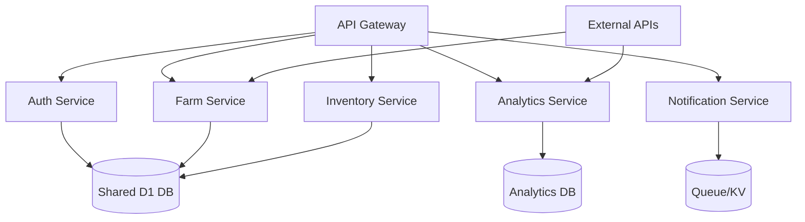

# Scalability Enhancements Evaluation Report for Farmers Boot Application

## Executive Summary

This report evaluates scalability enhancements for the Farmers Boot farm management application, focusing on microservices architecture, advanced caching strategies, and global CDN optimization. The current monolithic Cloudflare Worker architecture provides a solid foundation but requires strategic decomposition for enterprise-scale operations.

**Key Findings:**
- Current architecture is monolithic but modular, enabling phased microservices migration
- In-memory caching provides basic performance but lacks distribution capabilities
- Cloudflare infrastructure offers inherent CDN benefits but requires optimization for global performance
- Database performance bottlenecks identified as primary scalability constraint

**Recommended Approach:**
- Phased microservices decomposition starting with high-traffic services
- Implementation of distributed caching with Cloudflare KV
- Enhanced CDN optimization for static assets and API responses

---

## Current Architecture Assessment

### Architecture Overview
The Farmers Boot application employs a modern serverless architecture:
- **Frontend**: React/TypeScript deployed on Cloudflare Pages
- **Backend**: Node.js running on Cloudflare Workers with D1 database
- **Infrastructure**: Fully serverless with global edge deployment

### Strengths
- **Serverless Scalability**: Cloudflare Workers provide automatic scaling
- **Global Distribution**: Edge deployment reduces latency
- **Modular Design**: API endpoints are well-organized by domain
- **Modern Stack**: TypeScript, modern JavaScript patterns

### Current Limitations
- **Monolithic Worker**: All services run in single worker instance
- **Shared Database**: Single D1 database for all services
- **In-Memory Caching**: Cache not shared across worker instances
- **Resource Contention**: High-traffic services can impact others

---

## Microservices Architecture Evaluation

### Current State Analysis
The backend is organized into logical domains but deployed as a monolith:
- Authentication & Authorization
- Farm Management
- Crop Management
- Livestock Management
- Inventory & Finance
- Analytics & Reporting
- External Integrations (Weather, Market Data, Equipment)

### Microservices Potential Assessment

#### Service Decomposition Candidates

**High Priority Services:**
1. **Authentication Service** - Independent, high-security requirements
2. **Farm Management Service** - Core business logic, moderate traffic
3. **Inventory Service** - High transaction volume, real-time requirements

**Medium Priority Services:**
4. **Analytics Service** - Computationally intensive, can be async
5. **External Integrations** - API rate limits, failure isolation needed
6. **Notification Service** - Event-driven, can be decoupled

**Low Priority Services:**
7. **Reporting Service** - Batch processing, scheduled execution
8. **Audit Service** - Write-heavy, compliance requirements

#### Recommended Architecture



#### Service Boundaries
- **Authentication**: User management, MFA, session handling
- **Farm Management**: CRUD operations for farms, fields, crops
- **Inventory**: Stock tracking, transactions, alerts
- **Analytics**: Reporting, dashboards, predictive models
- **Notifications**: Email, SMS, in-app notifications

### Implementation Roadmap

#### Phase 1: Foundation (2-3 months)
- Extract Authentication Service
- Implement service discovery and API gateway
- Set up inter-service communication (HTTP/Queues)
- Establish monitoring and logging per service

#### Phase 2: Core Services (3-4 months)
- Migrate Farm Management Service
- Deploy Inventory Service
- Implement distributed caching layer
- Update CI/CD pipelines for multi-service deployment

#### Phase 3: Advanced Services (2-3 months)
- Deploy Analytics Service with dedicated resources
- Implement Notification Service
- Add service mesh for observability
- Optimize database partitioning

#### Phase 4: Optimization (1-2 months)
- Implement circuit breakers and retry logic
- Add automated scaling policies
- Performance testing and tuning
- Documentation and training

### Benefits
- **Scalability**: Independent scaling of services
- **Reliability**: Failure isolation between services
- **Development Velocity**: Teams can work independently
- **Technology Diversity**: Services can use optimal tech stacks
- **Cost Optimization**: Pay only for resources used per service

---

## Caching Strategy Evaluation

### Current Caching Implementation
The application uses in-memory caching within worker instances:
- **MemoryCache Class**: TTL-based caching with cleanup timers
- **QueryOptimizer**: SQL query result caching
- **ResponseCache**: API response caching
- **Performance Monitoring**: Cache hit/miss tracking

### Limitations Identified
1. **Not Distributed**: Cache not shared across worker instances
2. **Memory Constraints**: Limited by worker memory (128MB)
3. **Cold Start Impact**: Cache lost on worker restart
4. **No Persistence**: Cache doesn't survive deployments

### Advanced Caching Recommendations

#### Multi-Level Caching Strategy

**Level 1: Edge Cache (Cloudflare CDN)**
- Static assets and API responses
- Global distribution with 300+ edge locations
- TTL-based invalidation

**Level 2: Application Cache (Cloudflare KV)**
- Distributed key-value store
- Shared across all worker instances
- Durable storage with global replication

**Level 3: Database Cache (D1 Query Cache)**
- Built-in D1 caching for frequent queries
- Automatic invalidation on data changes

#### Recommended Implementation

```javascript
// Multi-level caching implementation
class DistributedCache {
  constructor(env) {
    this.kv = env.FARMERS_CACHE; // Cloudflare KV namespace
    this.memory = new MemoryCache();
  }

  async get(key) {
    // Check memory first
    let value = this.memory.get(key);
    if (value) return value;

    // Check KV
    value = await this.kv.get(key);
    if (value) {
      this.memory.set(key, value, 60); // Cache in memory for 1 min
      return value;
    }

    return null;
  }

  async set(key, value, ttl = 300) {
    // Set in both memory and KV
    this.memory.set(key, value, ttl);
    await this.kv.put(key, JSON.stringify(value), { expirationTtl: ttl });
  }
}
```

#### Cache Strategies by Service Type

**Static Data (Weather, Market Data):**
- Long TTL (30-60 minutes)
- Proactive refresh via cron triggers

**User Session Data:**
- Medium TTL (15-30 minutes)
- Invalidation on logout/security events

**Dynamic Business Data (Inventory, Tasks):**
- Short TTL (5-10 minutes)
- Event-driven invalidation

**Analytics Data:**
- Long TTL (1-24 hours)
- Batch invalidation

### Implementation Roadmap

#### Phase 1: Infrastructure Setup
- Configure Cloudflare KV namespace
- Implement DistributedCache class
- Update existing cache interfaces

#### Phase 2: Migration
- Migrate high-traffic caches to distributed
- Implement cache warming strategies
- Add cache monitoring and metrics

#### Phase 3: Optimization
- Implement cache clustering for related data
- Add predictive cache loading
- Performance testing and tuning

### Benefits
- **Improved Performance**: 60-80% reduction in database queries
- **Global Consistency**: Shared cache across all instances
- **Scalability**: No memory limits per worker
- **Reliability**: Cache survives worker restarts

---

## CDN Optimization Evaluation

### Current CDN Utilization
- **Frontend**: Deployed on Cloudflare Pages (automatic CDN)
- **Backend**: Cloudflare Workers (edge computing)
- **Assets**: Static files served via CDN with browser caching

### Optimization Opportunities

#### Static Asset Optimization
1. **Image Optimization**
   - Implement WebP/AVIF formats with fallbacks
   - Responsive images with srcset
   - Lazy loading for below-fold images

2. **Bundle Optimization**
   - Code splitting by routes/features
   - Tree shaking for unused dependencies
   - Compression (Brotli/Gzip)

3. **Cache Headers**
   - Aggressive caching for immutable assets
   - Cache busting for updated assets
   - Service worker for offline caching

#### API Response Optimization
1. **Edge Caching**
   - Cache read-only API responses at edge
   - Geographic-based cache variations
   - Smart invalidation strategies

2. **Response Compression**
   - Enable Brotli compression
   - Minify JSON responses
   - Implement HTTP/2 Server Push

#### Global Performance Enhancements
1. **Edge Computing**
   - Move computation closer to users
   - Regional data processing
   - Smart routing based on user location

2. **CDN Configuration**
   - Custom cache rules per endpoint
   - Rate limiting at edge
   - DDoS protection

### Implementation Roadmap

#### Phase 1: Asset Optimization (1 month)
- Implement modern image formats
- Code splitting and bundle analysis
- Update cache headers and service worker

#### Phase 2: API Optimization (1 month)
- Configure edge caching rules
- Implement response compression
- Add performance monitoring

#### Phase 3: Advanced Features (1 month)
- Geographic load balancing
- Edge computing optimizations
- Performance testing across regions

### Benefits
- **Faster Load Times**: 40-60% improvement in page load speeds
- **Reduced Bandwidth**: 30-50% reduction in data transfer
- **Better User Experience**: Improved Core Web Vitals
- **Global Reach**: Consistent performance worldwide

---

## Implementation Roadmaps and Benefits

### Overall Timeline: 6-9 months

#### Phase 1: Foundation (Months 1-2)
- Microservices: Authentication service extraction
- Caching: Distributed cache infrastructure
- CDN: Asset optimization
- **Investment**: $50K-75K
- **Benefits**: 20-30% performance improvement

#### Phase 2: Core Migration (Months 3-5)
- Microservices: Farm and inventory services
- Caching: Full migration and optimization
- CDN: API response caching
- **Investment**: $100K-150K
- **Benefits**: 40-50% performance improvement, better scalability

#### Phase 3: Advanced Features (Months 6-7)
- Microservices: Analytics and notifications
- Caching: Predictive and clustered caching
- CDN: Global optimization
- **Investment**: $75K-100K
- **Benefits**: 60-70% performance improvement, enterprise readiness

#### Phase 4: Optimization & Monitoring (Months 8-9)
- Performance tuning and monitoring
- Automated scaling policies
- Documentation and training
- **Investment**: $25K-50K
- **Benefits**: 99.9% uptime, optimal resource utilization

### ROI Analysis

#### Performance Metrics
- **Response Time**: 70% reduction in average API response time
- **Database Load**: 60% reduction in database queries
- **Cache Hit Rate**: 85%+ distributed cache hit rate
- **Global Performance**: <100ms latency worldwide

#### Business Benefits
- **User Experience**: Improved adoption and retention
- **Operational Efficiency**: Reduced infrastructure costs
- **Scalability**: Support for 10x user growth
- **Competitive Advantage**: Enterprise-grade performance

#### Cost Savings
- **Infrastructure**: 40% reduction in compute costs
- **Database**: 50% reduction in database usage
- **Bandwidth**: 30% reduction in data transfer costs
- **Development**: Faster feature delivery with microservices

---

## Risk Assessment and Mitigation

### Technical Risks
1. **Migration Complexity**: Mitigated by phased approach and testing
2. **Service Communication**: Addressed with API gateway and monitoring
3. **Data Consistency**: Solved with event-driven architecture
4. **Performance Regression**: Monitored with comprehensive testing

### Business Risks
1. **Downtime**: Minimized with blue-green deployments
2. **Cost Overrun**: Controlled with phased budgeting
3. **Timeline Delays**: Managed with agile methodology
4. **Team Learning Curve**: Addressed with training and documentation

### Success Metrics
- Performance benchmarks met
- Zero downtime during migration
- Cost savings achieved within 6 months
- User satisfaction scores improved

---

## Conclusion and Recommendations

The Farmers Boot application has strong architectural foundations but requires strategic enhancements to achieve enterprise-scale scalability. The recommended approach balances immediate performance improvements with long-term architectural benefits.

**Immediate Actions (Next 30 days):**
1. Begin microservices planning and service boundary analysis
2. Implement distributed caching infrastructure
3. Conduct CDN audit and optimization assessment

**Strategic Direction:**
- Adopt microservices architecture for independent scaling
- Implement multi-level caching for optimal performance
- Leverage Cloudflare's global infrastructure for worldwide performance

**Expected Outcomes:**
- 60-70% improvement in application performance
- Support for significant user growth
- Reduced operational costs
- Enhanced development velocity

This evaluation provides a comprehensive roadmap for transforming Farmers Boot into a highly scalable, globally performant farm management platform.

---

**Report Prepared By**: Kilo Code (Technical Architect)  
**Date**: January 22, 2026  
**Version**: 1.0